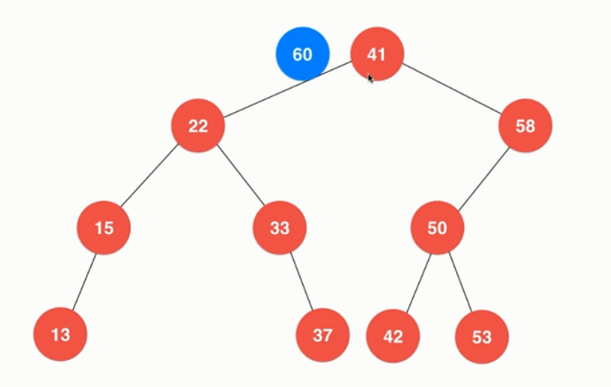
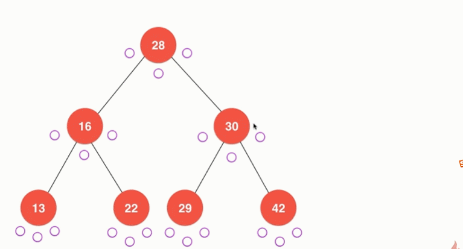
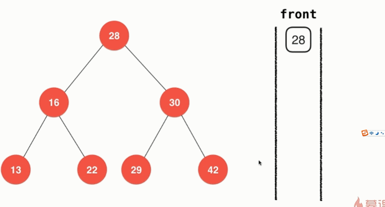
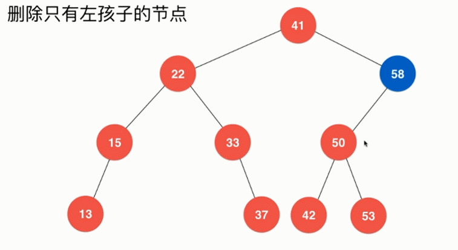
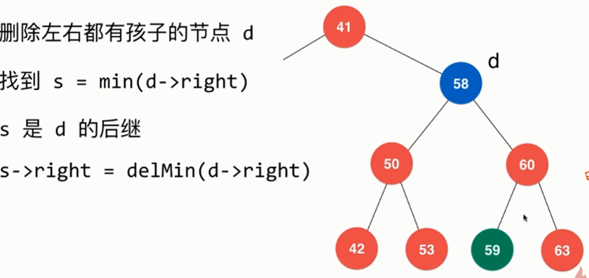
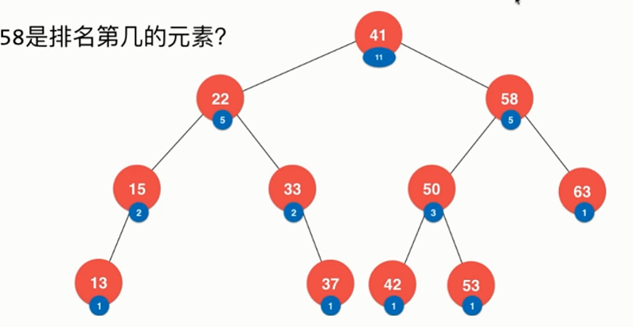
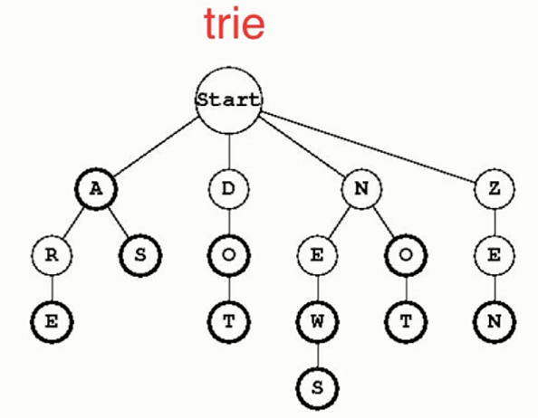
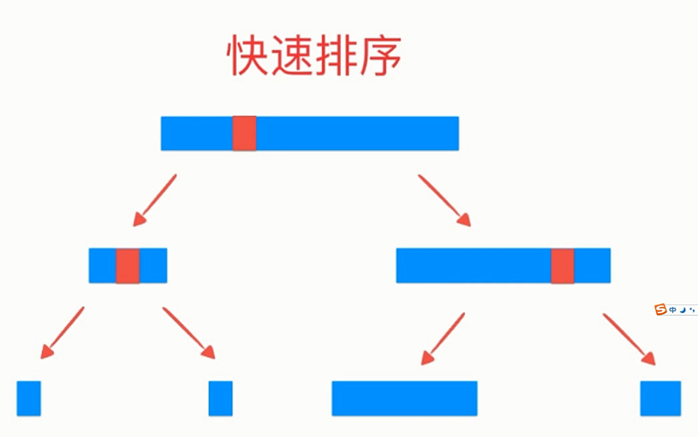
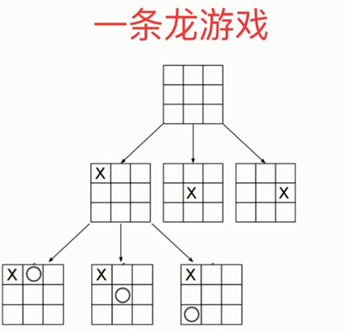
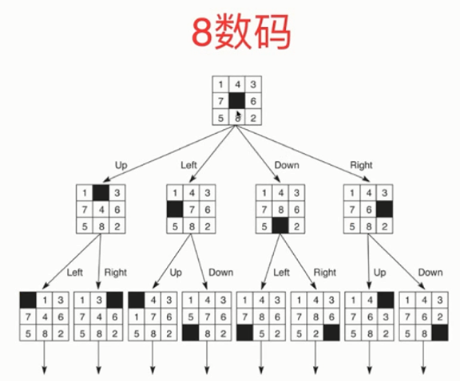

# 二分搜索树

### 作用
能高效的解决查找问题。一般用来左查找表的实现(字典数据结构)

对于查找元素、插入元素、删除元素。二分搜索树的时间复杂度都仅 O(logN), 可以高效的动态维护数据。
还可以方便的回答下列数据间的关系问题：
min, max, floor, ceil, rank, select

### 特征
> 二分搜索树不一定是一个完全二叉树
> 每一个节点大于它的左孩子，小于它的右孩子。
> 每一个节点将大于它左子树中所有的值，并且小于它所有右子树中所有的值


## 插入新节点
从根节点开始，依次比较当前节点与待插入节点的大小，如果小于当前节点，则插入到它的左子树，如果大于当前节点，则插入到他的右子树


```cpp
Node* insert(Node *node, Key key, Value value) {
  //如果节点为空，那么生成一个节点返回
  if(node == NULL) {
    count ++;
    return new Node(key, value);
  }
  //如果节点的key值相同，那么让新的value覆盖旧的value
  if( key == node->key ) {
    node->value = value;
  }
  //key值不等，需要查找它的左右子树
  else if( key < node->key) {
    node->left = insert(node->left, key, value);
  }
  else {
    node-> right = insert(node->right, key, value)
  }
  return node;
}
```

## 二分查找树的查找
```
/**
 * 在以node为根的二叉搜索树中查找key对应的value
 * 如果不存在这个key的话返回NULL, 所以返回类型为Value*
 */
Value* search(Node* node, Key key) {
  
  if(node == NULL) {
    return NULL;
  }
  if(node->key == key) {
    return &(node->value);
  }
  else if(key < node->key) {
    return search(node->left, key);
  }
  else{
    return search(node->right, key);
  }
}
```

## 深度遍历
### 前序遍历
先访问当前节点，再依次递归访问左右子树

### 中序遍历
先递归访问左子树，再访问自身，再递归访问右子树

### 后序遍历

先递归访问左右子树，再访问自身节点

## 广度遍历
广度优先遍历，即一层一层的、自左向右的遍历。

#### 实现方法：
使用一个队列来实现层序遍历。
首先将节点放到队列中。在该节点出队时，判断根原生是否又左右孩子节点，如果有的话将它的两个孩子节点也入队。




## 最小值和最大值
由于二叉搜索树的性质：一个节点的必定比它的左子树的所有元素大；必定比它右子树的所有元素小。
##### 二叉搜索树的最小值
从根节点除出发，一直往左找，直到节点没有左孩子，那么那个元素就是整棵树的最小值。
##### 二叉搜索树的最大值
 从根节点除出发，一直往右找，直到节点没有右孩子，那么那个元素就是整棵树的最大值。

## 删除节点

#### 删除最小节点
找到最左的节点删除
```cpp
Node* removeMin(Node* node) {
  if( node->left == NULL) {
    Node* rightNode = node->right;
    delete node;
    count --;
    return rightNode;
  }
  node->left = removeMin(node->left);
  return node;
}
```

#### 删除最大节点
找到最右的节点删除
```cpp
Node* removeMax(Node* node) {
  if(node->right == NULL){
    Node* leftNode = node->left;
    delete node;
    count --;
    return leftNode;
  }
  node->right = removeMax(node->right);
  return node;
}
```

#### 删除只有左孩子的节点


#### 删除只有右孩子的节点


#### 删除既有左孩子，又有右孩子的节点
从该节点的右子树中找一个最小的节点，然后将他从原位置移除，替代被删除的节点。


## 其他问题
### rank & select
某元素排在数中的排序是多少？
排名为n的元素是哪个元素？


### 支持重复元素的二分搜索树
为每个二分搜索树添加count字段记录这个节点保存了几个值


## 二分搜索树的局限性
二分搜索树插入的顺序不同，可能导致树的高度变得很大.
即二分搜索树可能退化成链表


### 改进与变种：
平衡二叉树： 红黑树


平衡二叉树和堆的结合： Treap

#### trie
使得查找一个单词的定义的时间复杂度是和这个单词本身的长度相关的，而和字典中本身有多少个单词无关


## 树形问题

递归法天然的树形性质

决策树

