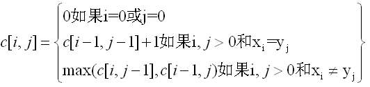

# 最长公共子序列

## 一个递归解
　　根据LCS的子结构可知，要找序列X和Y的LCS，根据xm与yn是否相等进行判断的，如果xm=yn则产生一个子问题，否则产生两个子问题。设C[i,j]为序列Xi和Yj的一个LCS的长度。如果i=0或者j=0，即一个序列的长度为0，则LCS的长度为0。LCS问题的最优子结构的递归式如下所示：

## 计算LCS的长度
　　采用动态规划自底向上计算解。将计算序列的长度保存到一个二维数组C[M][N]中，另外引入一个二维数组B[M][N]用来保存最优解的构造过程。M和N分别表示两个序列的长度。该过程的伪代码如下所示：
```
LCS_LENGTH(X,Y)
    m = length(X);
    n = length(Y);
    for i = 1 to m
      c[i][0] = 0;
    for j=1 to n
      c[0][j] = 0;
    for i=1 to m
       for j=1 to n
           if x[i] = y[j]
              then c[i][j] = c[i-1][j-1]+1;
                   b[i][j] = 1;
           else if c[i-1][j] >= c[i][j-1]
                  then c[i][j] = c[i-1][j];
                       b[i][j] = 2;
           else
               c[i][j] = c[i][j-1];
                b[i][j] = 3;
return c and b
```
## 构造一个LCS
　　根据第三步中保存的表b构建一个LCS序列。从b[m][n]开始，当遇到'\'时，表示xi=yj，是LCS中的一个元素。通过递归即可求出LCS的序列元素。

```
PRINT_LCS(b,X,i,j)
    if i==0 or j==0
        then return
    if b[i][j] == 2
        then PRINT_LCS(b,X,i-1,j-1)
             print X[i]
    else if b[i][j] == 3
        then PRINT_LCS(b,X,i-1,j)
else PRINT_LSC(b,X,i,j-1)
```
## 测试结果
### 测试数据范围： 
### 随机生成的字符串长度：100，200，300，... ，10000
### 字符范围： 200个
### 测试结果截图：横轴为字符串长度，纵轴为时间(单位毫秒)

## 结果分析
字符串长度与耗时曲线成下凹型，符合 O(n^2) 的规律