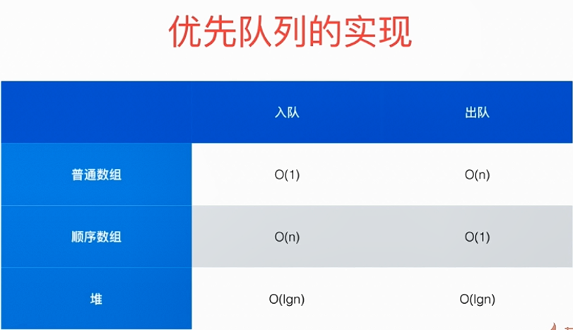
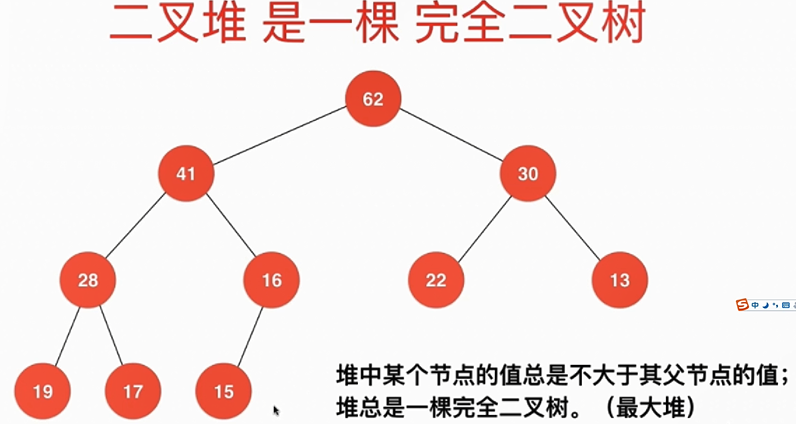
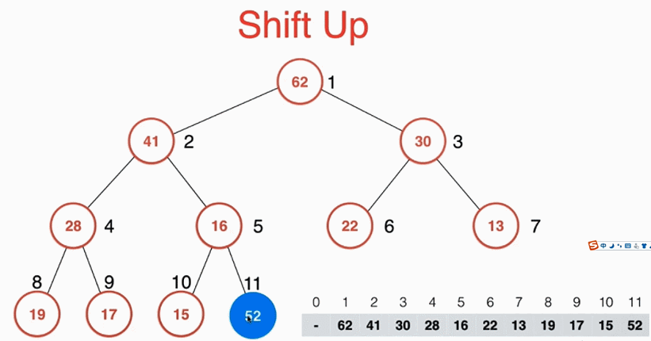
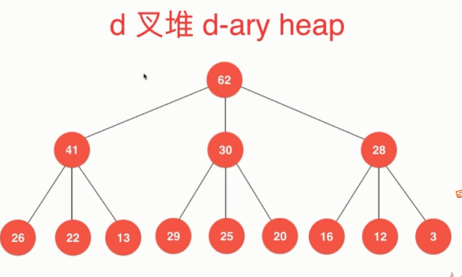

# 堆


## 优先队列

普通队列： 先进先出；后进后出
优先队列： 出队顺序和入队顺序无关，和优先级相关

使用堆这种数据结构可以使入队和出对的时间复杂度降低

对于总共 N 个请求：
使用普通数组或者顺序数组，最差情况 O(N^2)
使用堆： O(NlgN)

## 特征



## 用数组存储二叉堆

如果给堆中所有元素自上而下，自左向右给每个元素标上序号，那么堆满足如下关系：

- 对于每一个左节点来说，它的序号都是它父节点的二倍
- 对于每一个右节点来说，它的序号都是它父节点的二倍加一
  

```
parent (i) = i / 2
left child (i) = i * 2
right child (i) = i * 2 + 1
```

## 向堆中添加一个元素

- 在数组尾部添加该元素，count++
- 进行 shiftUp 操作

shiftUp： 即不断与它的父节点比较，如果它比它父节点大，那么就将他与父节点交互位置。


```javascript
void shiftUp(int pos)
{
  while (pos > 1 && data[pos / 2] < data[pos])
  {
    swap(data[pos / 2], data[pos]);
    pos /= 2;
  }
}
```

## 从堆中取出一个元素

注意，从堆中取元素每次只能取最顶部的那个元素

- 将堆中队顶部的元素(索引为 1)取出
- 将堆的最后一个元素放到堆顶部位置，将 count--
- 进行 shiftDown 操作

shiftDown ： 将当前元素与其左右孩子比较，将其与较大的那个元素交换位置


```javascript
void shiftDown(int pos)
{
  // 2 * pos <= count 表示该节点有左孩子
  while (2 * pos <= count)
  {
    int j = 2 * pos; // j代表此轮循环中，data[pos]和data[j]交换位置
    if (j + 1 <= count)
    { //判断是否有右孩子
      if (data[j + 1] > data[j])
      { //判断右孩子是否比左孩子大
        j++;
      }
    }
    if (data[pos] < data[j])
    {
      swap(data[pos], data[j]);
      pos = j;
    }
    else {
      break;
    }
  }
}
```

## Heapify

定义：给定一个数组，让数组变成最大堆
从第一个非叶子节点(索引为元素个数除以 2) 一直到第一个根节点进行 shiftDown 操作。

将 N 个元素逐个插入到一个空堆中，算法复杂度 O(NlongN)。
heapify 的过程，算法复杂度 O(n)


## 原地堆排序

对一个数组进行 Heapify 操作后，数组第一个位置的元素就是堆中最大的元素。
将第一个元素与数组倒数第一个元素交换位置，此时数组最大的元素就被放到数组末尾，在对第一个元素进行 shiftDown 操作，那么这个数组除末尾部分又是一个最大堆。
这样不断的将堆的最大那个元素(数组第一个元素)出堆，放到数组末尾，就可以实现原地的堆排序。

用数组存储二叉堆的特征：(下标从0开始)
> parent(i) = (i - 1) / 2
> left child(i) = i * 2 + 1
> right child(i) = i * 2 + 2
最后一个非叶子节点：(count - 1) / 2


# 堆的应用

## 实现优先队列
如果优先队列需要有频繁的插入与删除，并且队列中的元素值经常发生改变，那么就可以利用堆的优势来实现这种优先队列。
如操作系统的进程时间片切换。

## 在N个元素中选出前M个元素
如何在1,000,000个元素中选出前100名？

普通解法是将整个数组排序，时间复杂度为　O(NlogN)

如果使用最小堆来实现就可以将时间复杂度降低到 O(NlogM)
实现方法： 保证堆中的数量是永远小于等于M的。 当将前M个元素放入堆中后，再放入元素时就将堆中最小的那个元素出堆，维持整个堆依然是M个元素，每次维护一次堆耗时logM, 这样就使得时间复杂度降到 O(NlogM)

## 多路归并排序
普通的归并排序的merge操作是将两个有序的数组合并为一个有序的数组。
如果需要将多个有序数组合并为一个有序数组则可以使用堆来实现。即将这多个数组的第一个元素放进一个最小堆中，每次从最小堆中取出一个最小的元素，推出的这个最小元素属于哪个子数组就从哪个子数组中再添加一个元素进入堆中。

## d叉堆 d-ary heap
d越大，堆的层数越低。但是再shiftUp和shiftDown中比较的元素会变得更多一些。
