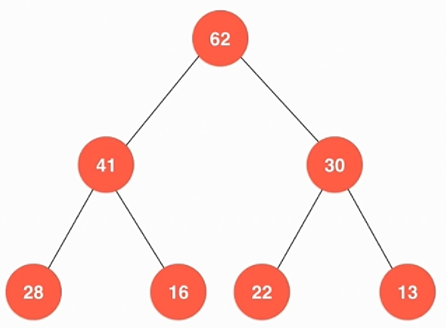
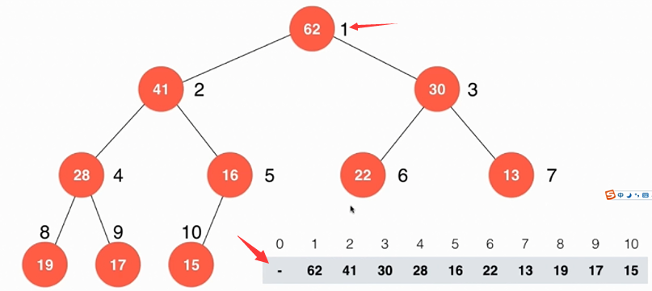
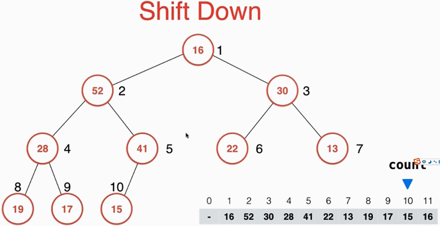

# 堆


## 优先队列
普通队列： 先进先出；后进后出
优先队列： 出队顺序和入队顺序无关，和优先级相关


使用堆这种数据结构可以使入队和出对的时间复杂度降低

对于总共N个请求：
使用普通数组或者顺序数组，最差情况 O(N^2)
使用堆： O(NlgN)


## 特征


## 用数组存储二叉堆
如果给堆中所有元素自上而下，自左向右给每个元素标上序号，那么堆满足如下关系：
 - 对于每一个左节点来说，它的序号都是它父节点的二倍
 - 对于每一个右节点来说，它的序号都是它父节点的二倍加一
  
```
parent (i) = i / 2
left child (i) = i * 2
right child (i) = i * 2 + 1
```

## 向堆中添加一个元素
 - 在数组尾部添加该元素，count++
 - 进行shiftUp操作
   
shiftUp： 即不断与它的父节点比较，如果它比它父节点大，那么就将他与父节点交互位置。

```javascript
void shiftUp(int pos)
{
  while (pos > 1 && data[pos / 2] < data[pos])
  {
    swap(data[pos / 2], data[pos]);
    pos /= 2;
  }
}
```

## 从堆中取出一个元素
注意，从堆中取元素每次只能取最顶部的那个元素
 - 将堆中队顶部的元素(索引为1)取出
 - 将堆的最后一个元素放到堆顶部位置，将count--
 - 进行shiftDown操作
  
shiftDown ： 将当前元素与其左右孩子比较，将其与较大的那个元素交换位置

```javascript
void shiftDown(int pos)
{
  // 2 * pos <= count 表示该节点有左孩子
  while (2 * pos <= count)
  {
    int j = 2 * pos; // j代表此轮循环中，data[pos]和data[j]交换位置
    if (j + 1 <= count)
    { //判断是否有右孩子
      if (data[j + 1] > data[j])
      { //判断右孩子是否比左孩子大
        j++;
      }
    }
    if (data[pos] < data[j])
    {
      swap(data[pos], data[j]);
      pos = j;
    }
    else {
      break;
    }
  }
}
```


## Heapify 
定义：给定一个数组，让数组变成最大堆
从第一个非叶子节点(索引为元素个数除以2) 一直到第一个根节点进行shiftDown操作。

将N个元素逐个插入到一个空堆中，算法复杂度O(NlongN)。
heapify的过程，算法复杂度O(n)


