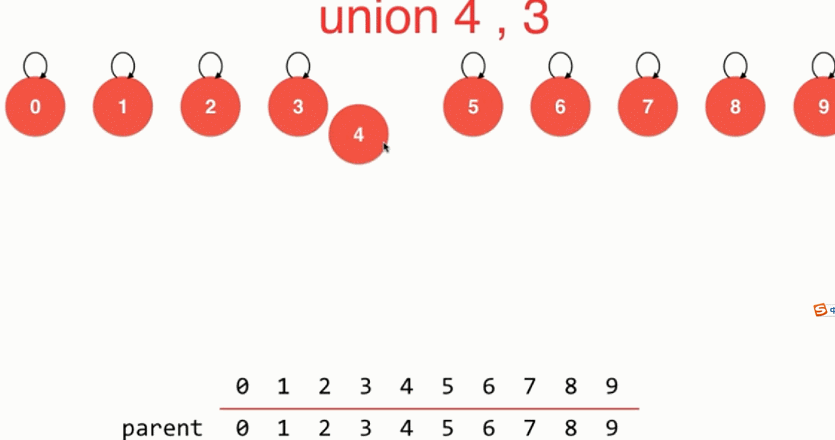
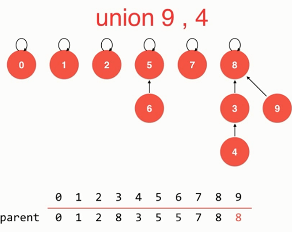
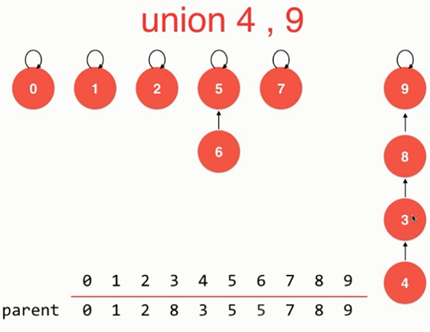
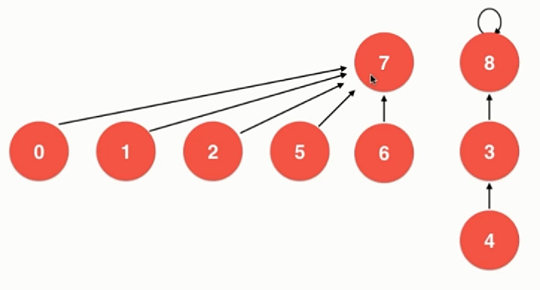
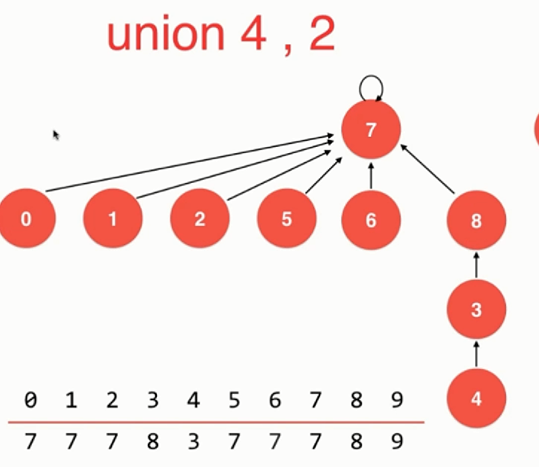
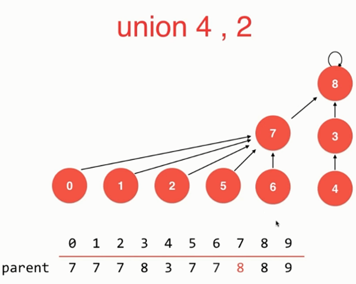
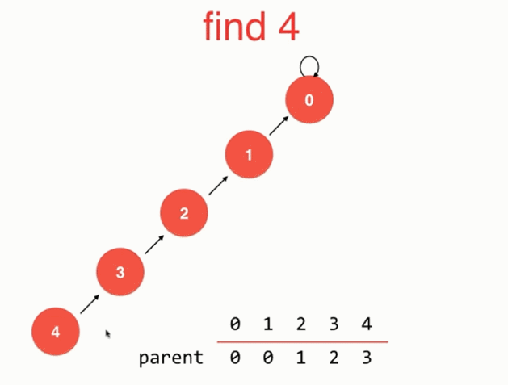

# 并查集
并查集可以非常高效的解决连接问题

> 连接问题
> 1. 图中节点间连接状态的判断
> 2. 集合类的实现

对于一组数据，并查集主要支持两个操作
 - union(p, q)
   - 将 p、q 两个元素合并在同意集合中
 - find(p)
   - 查一下p属于哪一个集合中

回答一个问题：
isConnected(p, q)  判断p和q是否连接起来

## 如何表示并查集

### 数组存储的并查集
两个数组，一个拿来存值，一个拿来存所属的集合好
```
     0 1 2 3 4 5 6 7 8 9
-------------------------
id:  0 0 1 1 0 0 1 1 1 1
```

### 树状结构的并查集
将每一个元素看作是一个节点，这个节点上一个指针指向另一个节点，直到一个根元素。
这棵构建出来的树就是一个并查集



### 将某元素到根元素路径上的节点直接指向的待指向根元素的优化
因为UnionFind2的合并集合过程中，直接将根元素指向另一个集合的根元素。

而我想出来的这个myUnionFind则是将从这个要合并的元素沿着自己的父节点向上查找，将沿路的根都直接指向目标根元素。
```cpp
// 合并元素p和元素q所属的集合
  void unionElements(int p, int q)
  {
    int qRoot = find(q);
    //如果这个节点不是根，并且这个节点没有指向合并的目标根节点
    if (parent[p] != p && parent[p] != qRoot)
    {
      unionElements(parent[p], q);
    }
    parent[p] = qRoot;
  }
```

### 基于集合数的优化
UnionFind2会出现下面的问题：



虽然都是将4和9归如同一集合，但是选择哪个元素作为根却使得整棵树的高度不同

解决方法：

记录每一个集合元素的个数，每次将元素少的集合挂到元素多的集合的根节点上去


### 基于rank的优化

UnionFind3已经是非常块速的，但是他是按照该集合的元素个数来进行合并的，而不说根据该集合的层数进行合并的。
看一下这个情况：

如果记录元素个数，那么会出现这样的情况，树的层数增多了。

而如果使用树的层数，则会避免这个问题。



### 路径压缩 
对find的优化


```cpp
int find(int p)
{
  assert(0 <= p && p < count);
  while (parent[p] != p)
  {
    // 路径压缩
    parent[p] = parent[parent[p]];
    p = parent[p];
  }
  return p;
}
```

### 将节点压缩到只有一层
