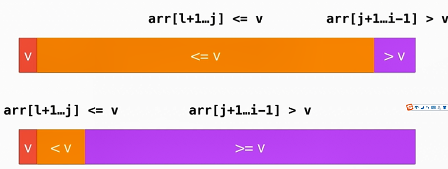
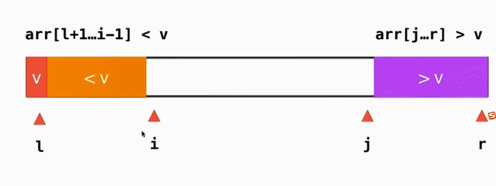
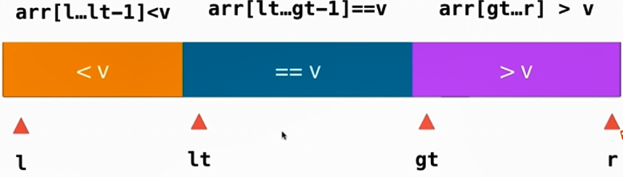

# 快速排序

## 基本思想
通过partition操作将数组划分为两个部分，使得数组前一部分的元素都比数组的某一个元素小，数组的后一部分元素都比数组某一个元素大。

## 单路快排
设置3个索引， l, j，i。
从数组的第二个位置开始，依次遍历数组。如果ｉ元素大于ｌ元素，那么继续遍历下一个元素，ｉ++ ；如果ｉ元素小于ｌ元素，那么交换arr[j+1]与arr[i], 再让ｊ加一。


## 缺点与优化
对于大多数O(n^2)级算法都可以优化的方法：
 在数据量很小的时候使用插入排序进行优化。

### 缺点1：对近乎有序的数组性能很低
在面对近乎有序的数组时，快速排序的效率是非常低的。因为快速排序对数组的划分是以当前需排序区域的第一个位置的元素作为基准值来划分的。如果数组近乎有序，那么划分时形成的数的平衡度很差，即小于基准值的区间近乎为0，而大于基准值的区间则很大。这样就会使快速排序退化到O（n^2）级。


#### 优化方法：

使用数组中间的那个元素作为待排序区间划分的基准值

#### partition函数
```javascript
int __partition(T arr[], int left, int right) {

  //优化，使用数组中间元素作为基准元素
  swap(arr[left], arr[(left + right) / 2]);  
  int standard = arr[left];
  // arr[l+1, j] < standard ; arr[j+1, i] > standard
  int j = left;
  for(int i = left + 1; i <= right; i++) {
    if(arr[i] < standard) {
      swap(arr[j + 1], arr[i]);
      j++;
    }
  }
  swap(arr[left], arr[j]);
  return j;
}
```

## 双路快排

### 单路快排存在的缺点
单路快排对于包含大量重复数据的数组性能很低。
原因： 当数组中出现大量重复元素时，partition操作非常可能会将数组将会被分成两个极度不平衡部分。这是因为对于每一个键值重复的元素太多，导致划分出的两部分差异非常大，这也会导致数组退化成 O(n^2)级的算法。



#### 优化方法
使用双路快排，将等于基准值的元素划分到数组的两端。



#### partition函数
```javascript
int __partition2(T arr[], int left, int right) {

  //优化，使用数组中间元素作为基准元素
  swap(arr[left], arr[(left + right) / 2]);  
  int standard = arr[left];

  // arr[left+1, i) <= standard ; arr(j, right] >= standard
  int i = left + 1, j = right;
  while(true) {
    while( i <= right && arr[i] < standard) {
      i ++;
    }
    while(j >= left+1 && arr[j] > standard) {
      j--;
    }
    if( i > j ) {
      break;
    }
    swap(arr[i], arr[j]);
    i++;
    j--;
  }

  swap(arr[left], arr[j]);
  return j;
}
```

## 三路快排

### 思想
将数组分为3个区间，小于基准值，等于基准值，大于基准值。
这样划分后对包含大量重复元素的数组有比较大的优化。因为双路快排将等于基准值的元素都划分到数组两边，而三路快排直接将等于基准值的元素集中在数组中间，这样就减少了下一次递归时就会减少partition函数处理的元素个数。


```javascript
/**
 * 将arr[l, r]分为 小于v, 等于v, 大于v 三部分
 * 之后递归对 小于v和大于v的部分进行三路快排
 */
template <typename T>
void __quickSort(T arr[], int left, int right) {
  if(left >= right) {
    return;
  }
  // mid 代表小于v的最右边的那个元素位置加一的位置, 即等于基准值的第一个元素, 使得 arr[left+1, mid) < v
  // rt 代表大于v的最左边的那个元素位置, 使得 arr(rt, right] > v
  // arr[mid, i) == v, 因为i是正在考察的元素，所以为右开区间
  int mid = left + 1, rt = right, i = left + 1;
  swap(arr[left], arr[(left + right) / 2]);
  T v = arr[left];
  // 如果arr[i] < v; 将等于基准值的第一个元素与当前元素交换
  while(i <= rt) {
    if(arr[i] < v) {
      swap(arr[mid], arr[i]);
      mid ++;
      i ++;
    } else if(arr[i] > v) {
      swap(arr[i], arr[rt]);
      rt --;
    } else {  //arr[i] === v
      i ++;
    }
  }
  swap(arr[left], arr[mid - 1]);
  __quickSort(arr, left, mid - 1);
  __quickSort(arr, rt + 1, right);
}
```