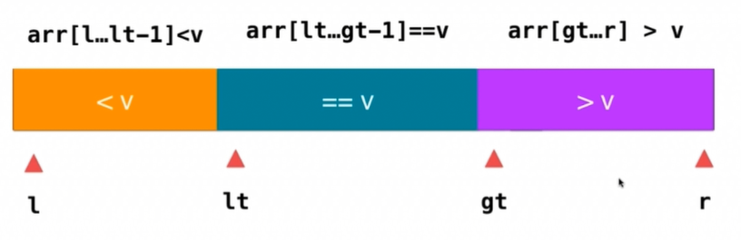
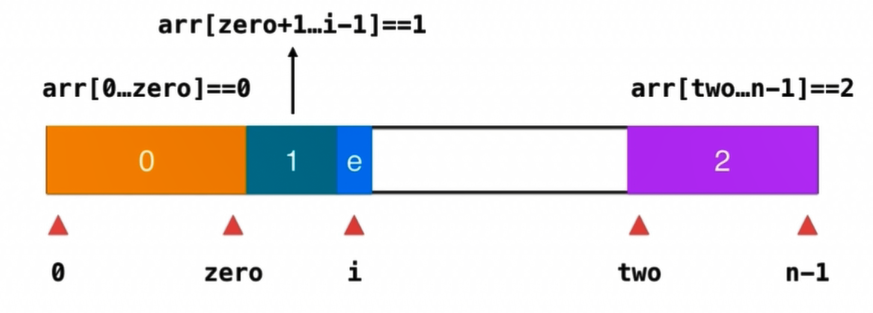

# 排序相关题目

## 75. 颜色分类
只包含3个元素（0，1，2）的数组，实现排序

### 计数排序法
分别统计0，1，2的元素个数，再赋值回去

```cpp
void sortColor(vector<int>& nums) {
  int colorType = 3;
  int count[colorType] = {0};
  for(int i = 0; i < nums.size(); i++) {
    assert( nums[i] >= 0 && nums[i] <=2 );
    count[ nums[i] ] ++;
  }

  int index = 0;
  for(int i = 0; i < colorType; i++) {
    for(int j = 0; j < count[i]; j++){
      nums[index++] = i;
    }
  }
}
```


### 三路排序法

因为数组只有3个元素，那么就可以使用三路快排的思想一遍循环解决问题。



 - 当元素等于中间值，i直接加一，相当于把元素划入1区间
 - 当元素大于中间值，将2区间前面那个数与当前数交互位置，two索引减一，就把这个值放入了2区间
 - 当元素小于中间值，将1区间的第一个值与元素交换位置，然后让zero指针加一，就把元素放入了0区间

```cpp
void sortColors(vector<int>& nums) {
  int zero = -1;          // arr[0, zero] == 0
  int two = nums.size();  // arr[two, n-1] == 2
  int index = 0;          // arr[zero+1, i-1] == 1

  while(index < two) {
    if(nums[index] == 1) {
      index ++;
    }
    else if(nums[index] == 2) {
      swap(nums[ --two ], nums[index]);
    }
    else {
      swap(nums[index], nums[++zero]);
      index++;
    }
  }
}
```


## 88. 合并两个有序数组
给定两个有序整数数组 nums1 和 nums2，将 nums2 合并到 nums1 中，使得 num1 成为一个有序数组。

说明:

 - 初始化 nums1 和 nums2 的元素数量分别为 m 和 n。
 - 你可以假设 nums1 有足够的空间（空间大小大于或等于 m + n）来保存 nums2 中的元素。

```
输入:
nums1 = [1,2,3,0,0,0], m = 3
nums2 = [2,5,6],       n = 3

输出: [1,2,2,3,5,6]
```

```js
var merge = function(nums1, m, nums2, n) {
  let m_index = 0,
      n_index = 0;
  let tempArr = nums1.slice(0,m);

  for(let i = 0; i < m + n; i ++) {
    if(m_index >= m) {
      nums1[i] = nums2[n_index++];
    }
    else if(n_index >= n) {
      nums1[i] = tempArr[m_index++];
    }
    else if(tempArr[m_index] < nums2[n_index]) {
      nums1[i] = tempArr[m_index++];
    }
    else if(n > 0) {
      nums1[i] = nums2[n_index++];
    }
  }
};
```


## 215 数组中的第K个最大元素
在未排序的数组中找到第 k 个最大的元素。请注意，你需要找的是数组排序后的第 k 个最大的元素，而不是第 k 个不同的元素。

解法，使用partition操作来找
```cpp
int __partition(vector<int>& arr, int l, int r)
{
  swap(arr[l], arr[(l + r) / 2]);
  int i = l + 1, j = r;
  int v = arr[l];
  while(true){
    while(i <= r && arr[i] > v){
      i ++;
    }
    while(j >= l && arr[j] < v){
      j --;
    }
    if(i > j){
      break;
    }
    swap(arr[i], arr[j]);
    i++;
    j--;
  }
  swap(arr[l], arr[j]);
  return j;
}
int __selection(vector<int>& arr, int l, int r, int k)
{
  if(l == r) {
    return arr[l];
  }
  int mid = __partition(arr, l, r);
  if(mid ==  k){
    return arr[mid];
  }
  else if(k < mid) {
    // 如果 k < p, 只需要在arr[l...p-1]中找第k小元素即可
    return __selection(arr, l, mid - 1, k);
  }
  else {
    // 如果 k > p, 则需要在arr[p+1...r]中找第k-p-1小元素
    return __selection(arr, mid + 1, r, k);
  }
}

int findKthLargest(vector<int>& nums, int k) {
    return __selection(nums, 0, nums.size() - 1, k - 1);
}
```