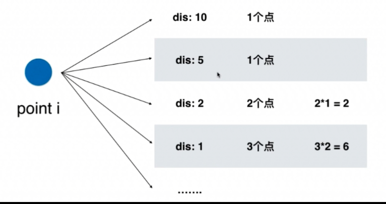

# map 相关题目

### 350. 查找两个数组中共有的元素（关注共有的数量）
```
输入: nums1 = [1,2,2,1], nums2 = [2,2]
输出: [2,2]
```

```cpp
vector<int> intersect(vector<int>& nums1, vector<int>& nums2) {
    
    map<int, int> record;
    for(int i = 0; i < nums1.size(); i ++) {
        record[ nums1[i] ] ++;
    }
    
    vector<int> resultVector;
    for(int i = 0; i < nums2.size(); i ++) {
        if(record[ nums2[i] ] > 0) {
            resultVector.push_back( nums2[i] );
            record[ nums2[i] ] --;
        }
    }
    
    return resultVector;
}
```


### 242. Valid Anagram
对比两个字符串是否只是位置交换而其他如长度、重复个数都没有改变
```cpp
bool isAnagram(string s, string t) {
    if (s.length() != t.length()) return false;
    unordered_map<char, int> resolve;
    for(int i = 0; i < s.size(); i++) {
        resolve[ s[i] ] ++;
    }
    for(int i = 0; i < t.size(); i++) {
        if(resolve[ t[i] ] > 0){
            resolve[ t[i] ] --;
        } else{
            return false;
        }
    }
    return true;
}
```


### 1. Two Sum
将所有的元素放入Map，之后对于每一个元素a，查找 target - a是否存在。
```cpp
vector<int> twoSum(vector<int>& nums, int target) {
    unordered_map<int, int> hash;
    vector<int> result;
    for (int i = 0; i < nums.size(); i++) {
        int numberToFind = target - nums[i];

        if (hash.find(numberToFind) != hash.end()) {
            result.push_back(hash[numberToFind]);
            result.push_back(i);			
            return result;
        }

        hash[nums[i]] = i;
    }
    return result;
}
```


### 四数相加 II
给定四个包含整数的数组列表 A , B , C , D ,计算有多少个元组 (i, j, k, l) ，使得 A[i] + B[j] + C[k] + D[l] = 0。

为了使问题简单化，所有的 A, B, C, D 具有相同的长度 N，且 0 ≤ N ≤ 500 。所有整数的范围在 -228 到 228 - 1 之间，最终结果不会超过 231 - 1 。

因为数据规模不超 500， 所以我们构造 C+D结果的map最大为2500，且A+B排列的值也最大为2500。 通过空间复杂度 O(n^2)来换取时间复杂度 O(n^2)

```cpp
// 时间复杂度 O(n^2)
// 空间复杂度 O(n^2)
int fourSumCount(vector<int>& A, vector<int>& B, vector<int>& C, vector<int>& D) {
    
    unordered_map<int,int> record;
    for(int i = 0; i < C.size(); i++) {
        for(int j = 0; j < D.size(); j++) {
            record[C[i] + D[j]] ++;
        }
    }
    
    int res = 0;
    for(int i = 0; i < A.size(); i ++) {
        for(int j = 0; j < B.size(); j ++) {
            if( record.find( 0 - A[i] - B[j] ) != record.end()){
                res += record[ 0 - A[i] - B[j]];
            }
        }
    }
    
    return res;
}
```


### 447. Number of Boomerangs
给出平面上的n个点，寻找存在多少个由这些构成的三元组（i,j,k)，使得i, j 两点的距离等于i, k两点的距离。其中n最多为500，且所有的点坐标的范围在[-10000, 10000]之间。

观察到 i 是一个枢纽，对于每一个点i,遍历其余点到i的距离（时间复杂度O(n^2)）


时间复杂度和空间复杂度都是： O(n^2)
```cpp
int numberOfBoomerangs(vector<pair<int, int>>& points) {
    int res = 0;
    for(int i = 0; i < points.size(); i++) {
        
        unordered_map<int, int> record;
        for(int j = 0; j < points.size(); j ++) {
            if(j != i) {
                record[ dis(points[i], points[j]) ] ++;
            }
        }
        
        for(unordered_map<int, int>::iterator iter = record.begin(); iter != record.end(); iter ++) {
            if(iter->second >= 2) {
                res += (iter->second) * (iter->second - 1);
            }
        }
    }
    return res;
}

int dis(const pair<int, int> &pa, const pair<int, int> &pb) {
    return (pa.first - pb.first) * (pa.first - pb.first) + (pa.second - pb.second) * (pa.second - pb.second);
}
```


### 220. Contains Duplicate III

给定一个整数数组，判断数组中是否有两个不同的索引 i 和 j，使得 nums [i] 和 nums [j] 的差的绝对值最大为 t，并且 i 和 j 之间的差的绝对值最大为 ķ。

```cpp
bool containsNearbyAlmostDuplicate(vector<int>& nums, int k, int t) {
    set<long long> record;
    for(int i = 0; i < nums.size(); i ++) {
        if(record.lower_bound((long long)nums[i] - (long long)t) != record.end() &&
            *record.lower_bound((long long)nums[i] - (long long)t) <= (long long)nums[i] + (long long)t) {
            return true;
        }
        
        record.insert( nums[i] );
        
        if(record.size() == k + 1) {
            record.erase(nums[i - k] );
        }
    }
    return false;
}
```