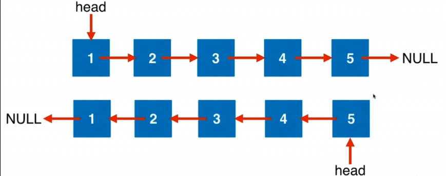

# 链表

### 206. 翻转链表
反转一个单链表。
```
输入: 1->2->3->4->5->NULL
输出: 5->4->3->2->1->NULL
```



需要使用3个指针
 - pre 指向当前指针所指前一个元素
 - cur 指向当前元素
 - next 指向当前元素的下一个元素

```cpp
ListNode* reverseList(ListNode* head) {
  ListNode* pre = NULL;
  ListNode* cur = head;
  
  while( cur != NULL ) {
    ListNode* next = cur->next;
    
    cur->next = pre;
    pre = cur;
    cur = next;
  }
  return pre;
}
```

### 92. 翻转链表 II
反转从位置 m 到 n 的链表。请使用一趟扫描完成反转。

1 ≤ m ≤ n ≤ 链表长度。

```
输入: 1->2->3->4->5->NULL, m = 2, n = 4
输出: 1->4->3->2->5->NULL
```

```cpp
ListNode* reverseBetween(ListNode* head, int m, int n) {

  struct ListNode* prev;              //反转后的部分
	struct ListNode* p = head;          //找反转的开始点
	struct ListNode* q = head;          //将反转前的部分和反转部分链接
	struct ListNode* temp;

  if(head->next==NULL||m==n)          
    return head;

	for (int i = 0; i < m - 1; i++)     //找到反转处的节点
		p = p->next;

	while (q->next != p)                //给反转的点做标记
	{
    if(m==1)
      break;
		q = q->next;
	}

	for (int i = m; i < n + 1; i++)     //反转
	{
		temp = p->next;
		p->next = prev;
		prev = p;
		p = temp;
	}

  if(m!=1)                             //若从头开始反转则直接将head作为反转的头部
	  q->next = prev;
  else
      head=prev;

	for (int i = 0; i < n - m; i++)
		prev = prev->next;

	prev->next = temp;                  //将反转后的链表和未反转的后半部分链接
	return head;
  
}
```